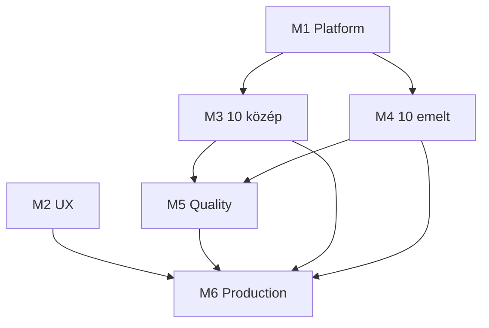

# Public beta milestones (közép + 10/10 catalog)

Target: **public beta for közép students** (~Oct 2026) with **10 közép + 10 emelt** exams covering sandbox edge cases.

**Out of scope for all milestones:** AI generation (Phase 8), AI grading, full auth, teacher dashboard, second hidden-swapped input file, shipping `mrz-kod` without full oracle.

Import these milestones into GitHub:

```bash
./scripts/create-github-milestones.sh
```

Requires `gh auth login` with `issues: write` on `lampmilan/tutor_me`.

---

## Milestone 1 — Platform: Sandbox edge cases

**Due:** 2026-09-14  
**Goal:** Tier B platform blockers so exams grade faithfully on hidden tests.

| # | Issue | Labels |
|---|-------|--------|
| 1.1 | [Per-test-case stdin in exam materialization](#issue-per-test-case-stdin) | `platform`, `grading` |
| 1.2 | [Inject random.seed from exam template](#issue-random-seed) | `platform`, `grading` |
| 1.3 | [Named function block in exam preamble](#issue-function-preamble) | `platform`, `emelt` |
| 1.4 | [Read-only auxiliary files in template](#issue-aux-files) | `platform`, `catalog` |

**Blocks:** Fogások, Hűtőház, Liftvezérlő, Palacsinta/Szólánc lookup tables.

---

## Milestone 2 — UX: Public beta (közép)

**Due:** 2026-09-21  
**Goal:** Student-facing polish for anonymous public beta (no auth required).

| # | Issue | Labels |
|---|-------|--------|
| 2.1 | [Resume workspace across sessions](#issue-workspace-resume) | `ux`, `beta` |
| 2.2 | [Hungarian student-facing UI copy](#issue-hu-ui) | `ux`, `beta`, `i18n` |
| 2.3 | [Exam discovery filters on homepage](#issue-filters) | `ux`, `beta` |
| 2.4 | [Show story, constraints, data explanation](#issue-context-panel) | `ux`, `beta` |
| 2.5 | [Hungarian execution and grading errors](#issue-hu-errors) | `ux`, `beta` |

**Deferred:** submission history UI, accounts, cross-device sync.

---

## Milestone 3 — Catalog: 10 közép exams

**Due:** 2026-10-12  
**Goal:** Launch set covering the közép sandbox matrix (GUIDE §4a).

| # | Exam | Status | Sandbox stress |
|---|------|--------|----------------|
| 3.1 | Városok (`cities`) | existing — verify | File + hidden swap, easy onboarding |
| 3.2 | Versenyidő | existing — verify | sum / avg / max |
| 3.3 | Fogások | convert synthetic MD | hardcoded→file + interactive threshold |
| 3.4 | Robot | new | path / command simulation |
| 3.5 | Liftvezérlő | new | random state (**needs seed**) |
| 3.6 | Szólánc | new | interactive loop + lookup table |
| 3.7 | Palacsinta | new | table-driven pricing |
| 3.8 | Létra or Szállítás | new | board sim or greedy carry |
| 3.9 | Kerékpárállomás | existing — verify/replace | threshold + tie-break |
| 3.10 | Befőzés or Kihívás | new | series + bonus / exact strings |

**Note:** trains / temperatures / students are redundant with cities/versenyido — demote if slots are tight.

Each exam issue checklist: `template.json`, `builders.py` if needed, visible + 3 hidden datasets, oracle test, Run+Submit smoke.

---

## Milestone 4 — Catalog: 10 emelt exams

**Due:** 2026-10-12  
**Goal:** Launch set covering emelt sandbox coordinates (GUIDE §4).

| # | Exam | Status | Sandbox stress |
|---|------|--------|----------------|
| 4.1 | Virágágyások | existing — verify | interval overlap, stdin, output file |
| 4.2 | Hűtőház | convert synthetic MD | event log, function, simulation, lookup |
| 4.3 | Menetlevél / fuvar | new | header + records + grouping |
| 4.4 | Beléptető-style | new | paired in/out matching |
| 4.5 | Kép / rács | new | 2-D grid |
| 4.6 | Pénztár-style | new | sentinel-delimited stream |
| 4.7 | Lookup join | new | aux table + transactions |
| 4.8 | Ütemezés-style | new | second `[function]` exam |
| 4.9 | Kert / output file | new | second `expected_file` exam |
| 4.10 | Validáló lánc | new | validate + simulation chain |

**Exclude from beta:** `mrz-kod` unless second file + checksum oracle is fully implemented.

---

## Milestone 5 — Quality: Oracle tests & CI

**Due:** 2026-10-05  
**Goal:** Catalog changes cannot silently break grading.

| # | Issue | Labels |
|---|-------|--------|
| 5.1 | Extend builder test suite for all 20 launch exams | `testing`, `ci` |
| 5.2 | CI: materialize all catalog exams on PR | `testing`, `ci` |
| 5.3 | Staging smoke: Run + Submit one feladat per exam | `testing`, `staging` |

---

## Milestone 6 — Production: Beta launch

**Due:** 2026-10-17  
**Goal:** Safe anonymous public deployment.

| # | Issue | Labels |
|---|-------|--------|
| 6.1 | Lock CORS to Vercel production origin | `production`, `security` |
| 6.2 | Rate limit `/execute` and `/judge` | `production`, `security` |
| 6.3 | Workspace TTL and cleanup job | `production`, `ops` |
| 6.4 | Beta launch checklist and smoke sign-off | `production`, `beta` |

**Deferred:** Docker executor on Cloud Run, full auth.

---

## Dependency graph



**Critical path:** M1 (per-test stdin) → content conversion (Fogások, Hűtőház) → M5 → M6.

---

## Issue bodies (for GitHub import)

### Issue: Per-test-case stdin {#issue-per-test-case-stdin}

**Title:** Per-test-case stdin in exam materialization

Allow different `stdin` values per test case (sample vs each hidden dataset).

**Why:** `templates.py` copies one `task.stdin` to every `TestCase`. Blocks Fogások, Hűtőház, Virágágyások hidden quality.

**Acceptance criteria:**
- Template supports per-hidden stdin (list aligned with hidden datasets or per-test override)
- Judge pipes correct stdin per test case
- Unit test with two hidden cases using different stdin

**Refs:** `backend/app/services/templates.py`, `.cursor/skills/erettsegi-to-catalog/reference.md`

---

### Issue: random.seed {#issue-random-seed}

**Title:** Inject random.seed from exam template

**Acceptance criteria:**
- Optional `seed` on `template.json`
- Preamble prepends `import random` + `random.seed(N)`
- Builders use same seed for expected output
- Smoke test with one random közép feladat

---

### Issue: Function preamble {#issue-function-preamble}

**Title:** Named function block in exam preamble

**Acceptance criteria:**
- Template field for function body (structured preamble: load + functions)
- Hűtőház `percben` works end-to-end after conversion
- Document in `erettsegi-to-catalog` skill

---

### Issue: Aux files {#issue-aux-files}

**Title:** Read-only auxiliary files in template

**Acceptance criteria:**
- `aux_files: [{filename, content, read_only}]` on template
- Copied into workspace on start; not swapped on hidden tests

---

### Issue: Workspace resume {#issue-workspace-resume}

**Title:** Resume workspace across sessions

**Acceptance criteria:**
- Persist `workspace_id` per exam (localStorage or URL)
- Reload when valid; new workspace only on explicit reset
- Works for anonymous users

**Ref:** `frontend/src/components/ExamWorkspace.tsx` always calls `startExam` today.

---

### Issue: Hungarian UI {#issue-hu-ui}

**Title:** Hungarian student-facing UI copy

Homepage, workspace actions (Run/Submit/Save), feladat labels, loading/errors in Hungarian.

---

### Issue: Filters {#issue-filters}

**Title:** Exam discovery filters on homepage

Filter by level (közép/emelt), difficulty; show tags on cards.

---

### Issue: Context panel {#issue-context-panel}

**Title:** Show story, constraints, and data explanation in workspace

Surface `Exam.story`, `constraints`, `data_explanation`; show minta stdin for interactive feladatok.

---

### Issue: Hungarian errors {#issue-hu-errors}

**Title:** Hungarian execution and grading error messages

Timeout, runtime fail, wrong answer — clear Hungarian feedback; hidden tests still hide expected/actual.

---

## Priority if time is tight

1. M1.1 per-test stdin  
2. M2.1 workspace resume + M2.2 Hungarian UI  
3. M1.2 random.seed + M1.3 function preamble  
4. M3 + M4 content (10+10)  
5. M5 CI  
6. M6 production hardening  
